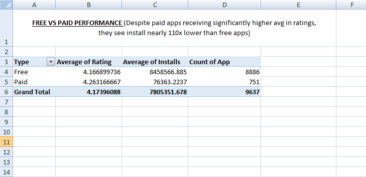
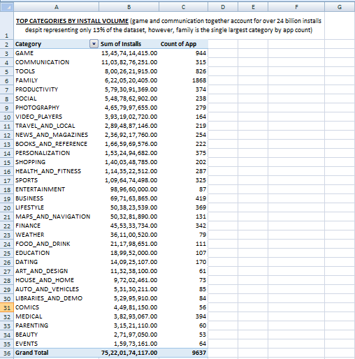

# Google Play Store Analytics: Ratings, Installs & Anomaly Detection

## Purpose
Analyzed Google Play Store app data to understand what actually drives app ratings, installs, and overall success — and to detect data inconsistencies through anomaly detection. Built as a portfolio project for the Google Data Analytics Apprenticeship.

## Dataset
- Source: [Google Play Store Apps dataset (Kaggle)](https://www.kaggle.com/datasets/lava18/google-play-store-apps)
- Raw file: `playstore_raw.csv` (10,841 records)
- Cleaned file: `playstore_cleaned.xlsx` (9,639 records)

## Tools Used
- Microsoft Excel (Pivot Tables, formulas, data cleaning)

## Data Cleaning Steps
- Removed 1,200+ duplicate app entries, keeping the record with the highest review count per duplicate group
- Converted bucketed/text fields to numeric: Installs (stripped "+" and ","), Price (stripped "$"), Size (standardized "M"/"k" units to MB)
- Fixed mislabeled "NaN" text values in the Rating column (converted to true blanks)
- Split the Genres column into Genre1/Genre2 for granular analysis
- Deleted a corrupted row caused by a shifted-column data entry error
- Built an Anomaly Flag column to detect Reviews-vs-Installs inconsistencies

## Key Findings

**1. Rating vs Category**
Average rating varies surprisingly little across categories (3.98–4.44). Dating apps post the lowest average rating (3.98), while Health & Fitness combines a strong 4.25 average with a large sample size (897 apps) — a genuine, reliable success story.

**2. Free vs Paid Performance**

Paid apps average a higher rating (4.26) than Free apps (4.17), but Free apps receive nearly **110x more installs** on average (8.46M vs 76K) — showing monetary barriers heavily suppress adoption even when quality is higher.

**3. Top Categories by Install Volume**

GAME and COMMUNICATION together account for over 24 billion installs despite representing only ~13% of the dataset. In contrast, FAMILY — the largest category by app count (1,868 apps) — generates a comparatively modest 6.2 billion installs, indicating intense competition and a "long tail" distribution.

**4. Rating vs Installs Correlation**
Correlation coefficient: **r = 0.04** — essentially no relationship. This suggests install volume is driven primarily by factors outside user satisfaction (category type, marketing reach, network effects) rather than perceived quality.

**5. Anomaly Detection**
Out of 9,639 cleaned records, an initial check flagged 11 apps where Reviews exceeded Installs. After correcting for Google Play's install-bucketing system (e.g., "10,000+" representing a minimum, not an exact count), only **1 genuine anomaly** remained — indicating the dataset is largely internally consistent.

## Impact
These findings suggest that rating alone is a weak predictor of app success. This has real implications for app developers and marketers: install growth strategy (marketing, category positioning, pricing) matters more than incremental quality improvements once a baseline rating is achieved.
